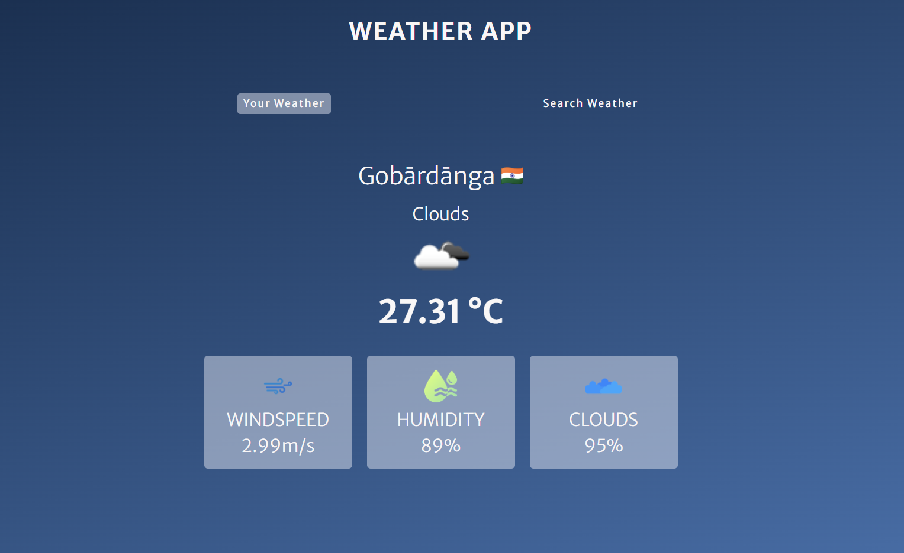

# 🌤️ Weather App

A clean, responsive, and interactive **Weather App** built using **HTML**, **CSS**, and **JavaScript**. It allows users to get real-time weather updates for their current location or search weather details for any city.

## 🚀 Features

- 🌎 Get weather data based on user's location (using Geolocation API)
- 🔍 Search weather by city name
- 🌡️ Displays temperature, humidity, wind speed, cloudiness, and weather condition
- 🖼️ Dynamic weather icons and country flags
- ⚠️ Error handling for invalid city names or location access denial
- 📱 Fully responsive UI

## 🖼️ Screenshots



## 🛠️ Tech Stack

- HTML5
- CSS3
- JavaScript (ES6)
- [OpenWeatherMap API](https://openweathermap.org/api)

## 📁 Project Structure

```
weather-app/
├── index.html
├── styles.css
├── index.js
└── assets/
```

## ⚙️ Setup Instructions

1. Clone this repository:
   ```bash
   git clone https://github.com/Amarsah15/Weather-App.git
   cd weather-app
   ```

2. Open `index.html` in your browser.

3. Make sure you have internet access to fetch weather data.

> ⚠️ **Note**: To use live weather data, you must add your own OpenWeatherMap API key in the JavaScript file (if not already included).

## 📦 API Used

- **OpenWeatherMap API** – Provides current weather data.

## ✨ Author

- [Amarnath Kumar](https://github.com/Amarsah15)
